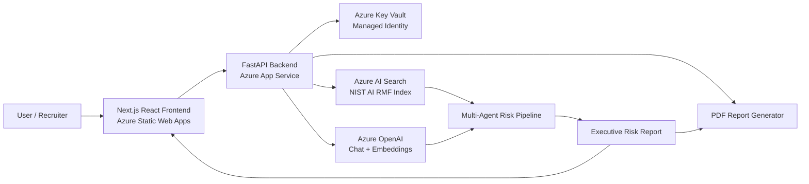
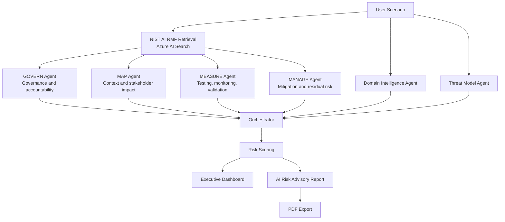

# AI Risk Advisor

**Live Demo:** https://nice-moss-085504f0f.7.azurestaticapps.net/

**Backend API:** https://ai-risk-advisor-api-cjfuheaafadsgdec.canadacentral-01.azurewebsites.net/

**GitHub Repository:** https://github.com/Alymazab/ai-risk-advisor

AI Risk Advisor is a deployed Azure AI governance platform that analyzes high-risk AI deployment scenarios using the NIST AI Risk Management Framework. It combines Azure OpenAI, Azure AI Search, Azure Key Vault, FastAPI, React, and PDF reporting to generate executive-style AI risk assessments.

This project was built as an Azure AI Engineer portfolio project to demonstrate practical cloud AI engineering, retrieval-augmented generation, multi-agent orchestration, secure secret handling, cloud deployment, and user-facing AI product design.

## Portfolio Highlights

* Deployed React / Next.js frontend on Azure Static Web Apps
* Deployed FastAPI backend on Azure App Service
* Azure OpenAI integration for AI risk analysis and report generation
* Azure AI Search retrieval layer for NIST AI RMF grounding
* Azure Key Vault integration with Managed Identity
* Multi-agent workflow aligned with NIST AI RMF: GOVERN, MAP, MEASURE, MANAGE
* Domain intelligence and threat-modeling agents
* Executive dashboard with risk score, readiness score, threat landscape, attack path visualization, radar chart, maturity bars, and risk matrix
* PDF export flow for advisory reports
* Public cloud deployment suitable for recruiter and portfolio review

## What the Application Does

The user submits an AI deployment scenario, such as:

> Assess the AI risks of deploying a customer-facing AI chatbot for a global financial services company that provides investment guidance, processes transactions, integrates with internal banking APIs, and handles sensitive customer data.

The platform then:

1. Retrieves relevant NIST AI RMF context from Azure AI Search.
2. Runs specialist AI risk agents aligned to NIST AI RMF functions.
3. Adds domain intelligence and threat-modeling analysis.
4. Synthesizes findings into an executive advisory report.
5. Generates risk scores, maturity indicators, and dashboard metrics.
6. Produces a downloadable PDF report.

## Live Experience

The deployed frontend includes:

* Scenario console with finance, healthcare, HR, and defense examples
* Multi-agent execution pipeline
* Executive risk dashboard
* Risk score gauge
* Threat landscape panel
* Attack path visualization
* AI governance readiness score
* Top enterprise risks
* Control maturity indicators
* NIST function radar and bar charts
* Likelihood × impact risk matrix
* Full report viewer
* PDF export

## High-Level Architecture



## Multi-Agent Workflow



## Azure Services Used

* Azure Static Web Apps
* Azure App Service
* Azure OpenAI
* Azure AI Search
* Azure Key Vault
* Azure Managed Identity
* GitHub Actions deployment workflow

## Technology Stack

### Frontend

* Next.js
* React
* TypeScript
* Tailwind CSS
* Recharts
* Lucide React
* Framer Motion
* Azure Static Web Apps

### Backend

* FastAPI
* Python
* Azure OpenAI SDK
* Azure AI Search SDK
* Azure Key Vault SDK
* ReportLab
* Matplotlib
* Azure App Service

### AI / Retrieval

* Azure OpenAI chat deployment
* Azure OpenAI embedding deployment
* Azure AI Search vector/hybrid retrieval
* NIST AI RMF indexed knowledge base
* NIST AI RMF Playbook retrieval

## Repository Structure

```text
app/
  agents/                 Multi-agent AI risk analysis workflow
    orchestrator.py       Coordinates specialist agents and final report synthesis
    govern_agent.py       GOVERN function analysis
    map_agent.py          MAP function analysis
    measure_agent.py      MEASURE function analysis
    manage_agent.py       MANAGE function analysis
    playbook_agent.py     NIST AI RMF Playbook retrieval
    threat_model_agent.py Threat-model intelligence
    domain_intelligence_agent.py Domain-specific risk intelligence

  ingestion/              NIST PDF loading, chunking, indexing, and upload
  rag/                    Azure AI Search retrieval and embedding helpers
  report/                 PDF report generation
  risk/                   Risk scoring and dashboard metrics
  security/               Key Vault and local secret handling
  ui.py                   Legacy Streamlit prototype

backend/
  main.py                 FastAPI application and API endpoints
  schemas.py              Request and response models

frontend/
  app/                    Next.js app router frontend
  package.json            Frontend dependencies
  next.config.ts          Next.js configuration

tests/
  Unit tests for chunking, source extraction, and supporting logic

docs/
  Deployment and project notes

examples/
  Sample advisory report output
```

## API Endpoints

The deployed FastAPI backend exposes:

```text
GET  /
GET  /health
POST /analyze
POST /export-pdf
```

### `GET /`

Returns service status.

### `POST /analyze`

Accepts an AI deployment scenario and returns:

* advisory report
* risk score
* NIST function scores
* dashboard metrics

### `POST /export-pdf`

Generates a downloadable PDF advisory report.

## Example Request

```json
{
  "scenario": "Assess the AI risks of deploying a customer-facing AI chatbot for a global financial services company that provides investment guidance, processes transactions, integrates with internal banking APIs, and handles sensitive customer data."
}
```

## Environment Variables

```env
AZURE_KEY_VAULT_URL=https://<your-key-vault-name>.vault.azure.net/
AZURE_OPENAI_ENDPOINT=https://<your-azure-openai-resource>.openai.azure.com/
AZURE_OPENAI_API_VERSION=2024-02-01
AZURE_OPENAI_EMBEDDING_DEPLOYMENT=<your-embedding-deployment-name>
AZURE_OPENAI_CHAT_DEPLOYMENT=<your-chat-deployment-name>
AZURE_SEARCH_ENDPOINT=https://<your-search-service>.search.windows.net
AZURE_SEARCH_INDEX_NAME=ai-risk-advisor-index
```

For local development only:

```env
AZURE_OPENAI_API_KEY=<local-dev-only>
AZURE_SEARCH_ADMIN_KEY=<local-dev-only>
```

In Azure, secrets should be stored in Key Vault and accessed through Managed Identity instead of hardcoded keys.

## Local Development

Clone the repository:

```bash
git clone https://github.com/Alymazab/ai-risk-advisor.git
cd ai-risk-advisor
```

Create and activate a Python virtual environment:

```bash
python -m venv .venv
.venv\Scripts\activate
```

Install backend dependencies:

```bash
pip install -r requirements.txt
```

Create a `.env` file from the template:

```bash
copy .env.example .env
```

Run the FastAPI backend:

```bash
python -m uvicorn backend.main:api --reload --port 8001
```

Open the API docs:

```text
http://127.0.0.1:8001/docs
```

Run the frontend:

```bash
cd frontend
npm install
npm run dev
```

Open:

```text
http://localhost:3000
```

## Data Setup

Download the NIST AI RMF PDF and place it here:

```text
data/raw/nist_ai_rmf.pdf
```

Create the Azure AI Search index:

```bash
python -m app.ingestion.create_search_index
```

Upload chunks and embeddings:

```bash
python -m app.ingestion.upload_chunks_to_search
```

## Legacy Streamlit Prototype

The repository includes an earlier Streamlit prototype:

```bash
streamlit run app/ui.py
```

The current deployed application uses:

```text
Frontend: Next.js on Azure Static Web Apps
Backend: FastAPI on Azure App Service
```

## Why This Project Matters

AI Risk Advisor is designed to demonstrate more than prompt engineering. It shows how an AI system can be grounded in a real governance framework, connected to Azure services, deployed as a cloud application, and presented through a business-friendly product interface.

For Azure AI Engineer roles, this project demonstrates:

* Azure OpenAI application development
* Retrieval-augmented generation with Azure AI Search
* Secure secret access using Azure Key Vault and Managed Identity
* FastAPI backend deployment on Azure App Service
* React frontend deployment on Azure Static Web Apps
* Multi-agent orchestration
* NIST AI RMF governance alignment
* Executive reporting and PDF generation
* Practical AI product thinking

## Current Limitations

* Public usage should be rate-limited or restricted to control Azure OpenAI cost.
* Report content is optimized for portfolio demonstration, not production advisory use.
* PDF design is functional but still being improved.
* Evaluation coverage is currently lightweight.
* Additional tests are planned for groundedness, citation accuracy, prompt injection resistance, unsafe output handling, and response schema validation.
* Application Insights telemetry and request tracing are planned.

## Roadmap

* Add screenshots and walkthrough GIFs to the README
* Add Application Insights monitoring
* Add stronger automated evaluations
* Add OWASP Top 10 for LLM Applications mapping
* Add prompt injection and unsafe-output test suites
* Add architecture upload and AI system diagram analysis
* Add infrastructure-as-code using Bicep or Terraform
* Improve PDF visual design with richer charts and executive layouts
* Add demo rate limiting or authentication for public usage control

## Resume Bullet

Built and deployed a full-stack Azure AI governance platform using Azure OpenAI, Azure AI Search, Azure Key Vault, FastAPI, React, and NIST AI RMF to generate executive AI risk assessments, threat models, control plans, dashboard metrics, and PDF reports for enterprise AI deployment scenarios.

## License

MIT License.
